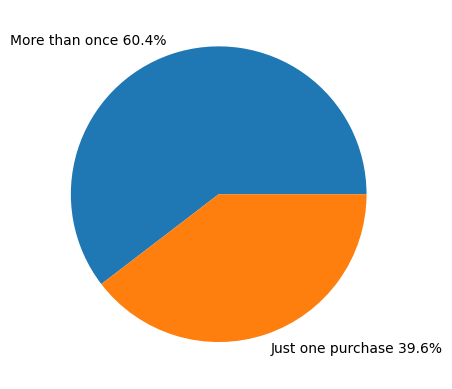
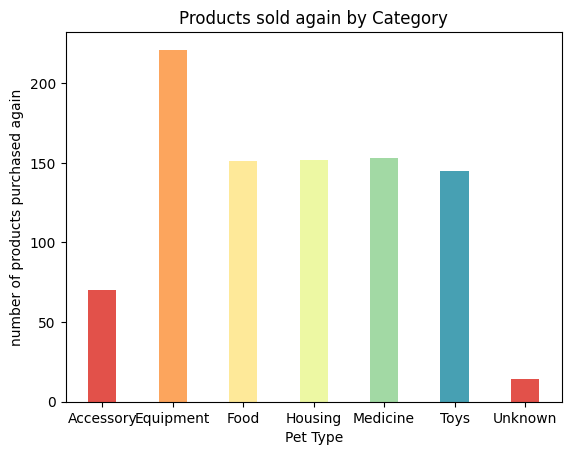
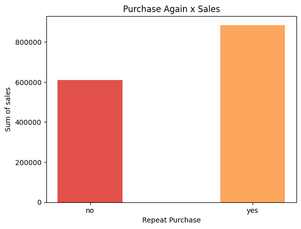
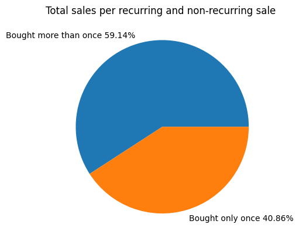
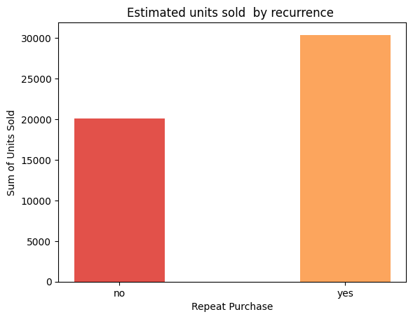

# Data Analyst Associate Practical Exam Submission

**You can use any tool that you want to do your analysis and create visualizations. Use this template to write up your summary for submission.**

You can use any markdown formatting you wish. If you are not familiar with Markdown, read the [Markdown Guide](https://s3.amazonaws.com/talent-assets.datacamp.com/Markdown+Guide.pdf) before you start.

## Task 1

The original dataset has **1500 rows** and **8 columns**. Using Python and the Pandas library, the first thing I did was inspect the datatype of each column using df.info(), obtaining the following results:

|#|Column|Non-Null Count|Dtype|  
|---|---|---|---|   
 |0|product_id|1500 non-null|int64  
 |1|category|1500 non-null|object 
 |2|animal|1500 non-null|object 
 |3|size|1500 non-null|object 
 |4|price|1500 |non-null|object 
 |5|sales|1500 non-null|float64
 |6| rating|**1350 non-null**|float64
 |7|repeat_purchase 1500|non-null|int64 
 
 
In this context, the conversion of data listed as "object" was necessary. For the 'price' column, it was necessary to correct null values, entered in the form of a string, in order to later convert the datatype to float. As requested, the null value was replaced with the overall median of 'price' and rounded to two decimal places. Finishing up the treatment of this column, the conversion to float was completed.
`df['price'] = df['price'].astype(str).str.replace('unlisted', np.empty)

df['price'] = df['price'].astype(float)

df['price'].fillna(df['price'].mean(), inplace=True)

df['price'] = round(df['price'], 2)``

The product_id column is made up of a set of unique, non-null integer numbers, as expected. 

The category column has string values, but there is a category with unknown values. As requested, the category was renamed to "Unknown", resulting in the following unique values: 'Food', 'Housing', 'Medicine', 'Toys', 'Equipment', 'Accessory', 'Unknown'.
The animal column has the following unique values: 'Bird', 'Dog', 'Cat', 'Fish'; and no null values, as expected. 

The size column has duplicated and non-normalized values. It was necessary to replace strings so that only the following values were left as requested: 'Large', 'Medium', 'Small'. No null value was found. In the sales column, no null value was identified and the float format is already appropriate. No modification was necessary. 

By the method `df.isna().sum()`, it is observed that the rating column has 150 null values. In addition, the float format is not appropriate for discrete values, it was necessary to convert to integer values and replace null values with 0 as requested: 

`df['rating'] = pd.to_numeric(df['rating'], errors='coerce').fillna(0).astype(int)`. 

The repeat_purchase column only has boolean values (0, 1), with no occurrence of null values or outside the expected range. To better support the analysis, it was necessary to create a new column in the dataset, 'unit_sold', due to the need to estimate how many units were actually sold in each category. To better enable data visualization, conversion of boolean values to string 'yes' and 'no' was also carried out. Therefore, the final dataset used for analysis has **1500 rows** and **9 columns**:

|#|Column|Non-Null Count|Dtype|  
|---|---|---|---|   
|0|product_id|1500 non-null|int64  
|1|category|1500 non-null|object 
|2|animal|1500 non-null|object 
|3|size|1500 non-null|object 
|4|price|1500 non-nul|float64
|5|sales|1500 non-null|float64
|6|rating|1500 non-null|int64  
|7|repeat_purchase|1500 non-null|object 
|8|unit_sold|1500 non-null|float64
dtypes: float64(3), int64(2), object(4)

## Task 2
### a. State which category of the variable repeat purchases has the most observations
### b. Explain whether the observations are balanced across categories of the variable repeat purchases

Classifying the products as repeat purchases and single purchases, dividing by the total number of products in the catalog, and multiplying the result by 100, we obtain that 60.4% of the products have repeat purchases while 39.6% were purchased only once:

Filtering the dataset to encompass only products purchased repeatedly and grouping the data by category, we observe that the Equipment category has the highest occurrence with a count of 221 products. Medicine, Housing, and Food appear next with a quite similar occurrence (153, 152, and 151 respectively). The "Unknown" category has the lowest number of occurrences, totaling 14:

Based on bar chart, it seems that the observations are not perfectly balanced across categories of the variable repeat purchases. This indicates that there might be a difference in the popularity of products across categories and further analysis is required to understand the cause of this imbalance.

## Task 3

As previously seen, products in the catalog with recurring sales are the majority, around 60.4% of products in the dataset. Now let's analyze if the total sold between products with recurring and non-recurring purchases also follows a similar metric:

We observe that the 'sales' volume for the repeat purchase category is higher than for products not purchased with recurrence. The total 'sales' for recurrently purchased products is 84046.17 while for those not purchased with recurrence it is $610,850.60. In percentage, these metrics correspond to 59.14% and 40.86%, respectively. 

By using the column 'unit_sold', which was created by dividing the 'sales' column by the 'price' column, we can get an approximate metric for the number of units sold. This is only an estimate because we don't know if the 'price' variable remained constant throughout the year for all products in the dataset. For a more accurate analysis, more information should be requested from the responsible team.

It can be observed from the bar chart that yes, the units with the most sales are included in the repeat purchase category. The information presented in the analysis indicates that the sale of recurring products has a positive impact on overall sales. Additionally, the fact that the recurring product category has higher demand suggests that the Pet Shop can successfully focus on customer loyalty actions to keep them buying the same products frequently. However, to assess the real impact of these actions, more information would be needed and a deeper analysis would have to be performed.
